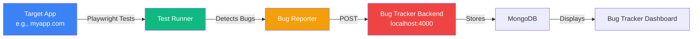

# Testing Target Applications with Playwright

## 🎯 Overview

This guide shows you how to use Playwright to test **ANY external application** and automatically report bugs to **this bug tracker system**.



---

## 📁 Setup for Target Application

### Option 1: Separate Test Project (Recommended)

Create a new test project for your target app:

```
my-target-app-tests/
├── package.json
├── playwright.config.js
├── tests/
│   ├── helpers/
│   │   └── bug-reporter.js      # Points to bug tracker backend
│   └── e2e/
│       ├── homepage.spec.js
│       ├── login.spec.js
│       └── checkout.spec.js
└── .env
```

**Step-by-step setup:**

#### 1. Create new directory
```bash
mkdir my-target-app-tests
cd my-target-app-tests
npm init -y
```

#### 2. Install Playwright
```bash
npm install -D @playwright/test
npx playwright install
```

#### 3. Copy the bug reporter utility
Copy `bug-reporter.js` from this project:
```bash
# From this bug tracker project root
cp tests/helpers/bug-reporter.js ../my-target-app-tests/tests/helpers/
```

#### 4. Create configuration file
Create `playwright.config.js`:

```javascript
import { defineConfig } from '@playwright/test';

export default defineConfig({
  testDir: './tests',
  fullyParallel: true,
  retries: 1,
  
  use: {
    // Your target app URL
    baseURL: 'https://your-target-app.com',
    screenshot: 'only-on-failure',
    video: 'retain-on-failure',
  },
  
  projects: [
    {
      name: 'chromium',
      use: { ...devices['Desktop Chrome'] },
    },
  ],
});
```

#### 5. Configure bug tracker endpoint
Edit `tests/helpers/bug-reporter.js`:

```javascript
// Change this line to point to your bug tracker
const BACKEND_URL = process.env.BUG_TRACKER_URL || 'http://localhost:4000';
```

Or create `.env` file:
```
BUG_TRACKER_URL=http://your-bug-tracker-backend:4000
```

---

### Option 2: Add to Existing Project

If your target app already has Playwright tests:

#### 1. Copy bug reporter
```bash
# Copy from bug tracker project
cp /path/to/bug-tracker/tests/helpers/bug-reporter.js ./tests/helpers/
```

#### 2. Import and use in your tests
```javascript
// In your existing test files
import { reportBug, reportTestFailure } from './helpers/bug-reporter.js';

test('my test', async ({ page }) => {
  try {
    await page.goto('https://myapp.com');
    // Your test logic
  } catch (error) {
    await reportBug({
      type: 'TEST_FAILURE',
      message: error.message,
      url: page.url(),
      severity: 'High',
      testName: 'my test'
    });
    throw error;
  }
});
```

---

## 📝 Example: Testing External Application

Here's a complete example for testing an external e-commerce site:

### File: `tests/e2e/ecommerce-test.spec.js`

```javascript
import { test, expect } from '@playwright/test';
import { 
  reportBug, 
  reportTestFailure, 
  reportConsoleError,
  reportNetworkError 
} from '../helpers/bug-reporter.js';

test.describe('E-Commerce Site Tests', () => {
  test.beforeEach(async ({ page }) => {
    // Monitor console errors
    page.on('console', async (msg) => {
      if (msg.type() === 'error') {
        await reportConsoleError(msg, page.url(), 'E-Commerce - Console Error');
      }
    });

    // Monitor network errors
    page.on('response', async (response) => {
      if (response.status() >= 400) {
        await reportNetworkError(response, page.url(), 'E-Commerce - Network Error');
      }
    });
  });

  test('Homepage loads correctly', async ({ page }) => {
    const TARGET_URL = 'https://your-ecommerce-site.com';
    
    try {
      await page.goto(TARGET_URL);
      
      // Check for essential elements
      await expect(page.locator('header')).toBeVisible();
      await expect(page.locator('nav')).toBeVisible();
      
      console.log('✅ Homepage loaded successfully');
    } catch (error) {
      await reportBug({
        type: 'PAGE_LOAD_FAILURE',
        message: `Homepage failed to load: ${error.message}`,
        url: TARGET_URL,
        severity: 'Critical',
        testName: 'E-Commerce - Homepage Load',
        applicationUrl: TARGET_URL,
        module: 'Homepage'
      });
      throw error;
    }
  });

  test('Search functionality works', async ({ page }) => {
    try {
      await page.goto('https://your-ecommerce-site.com');
      
      // Test search
      await page.fill('input[name="search"]', 'laptop');
      await page.click('button[type="submit"]');
      
      // Wait for results
      await page.waitForSelector('.search-results', { timeout: 5000 });
      
      const resultCount = await page.locator('.product-item').count();
      expect(resultCount).toBeGreaterThan(0);
      
      console.log(`✅ Found ${resultCount} search results`);
    } catch (error) {
      await reportBug({
        type: 'SEARCH_FAILURE',
        message: `Search functionality failed: ${error.message}`,
        url: page.url(),
        severity: 'High',
        testName: 'E-Commerce - Search',
        module: 'Search'
      });
      throw error;
    }
  });

  test('Add to cart works', async ({ page }) => {
    try {
      await page.goto('https://your-ecommerce-site.com/products/123');
      
      // Click add to cart
      await page.click('button:has-text("Add to Cart")');
      
      // Verify cart count updated
      const cartBadge = page.locator('.cart-count');
      await expect(cartBadge).toBeVisible();
      
      console.log('✅ Add to cart successful');
    } catch (error) {
      await reportBug({
        type: 'CART_FAILURE',
        message: `Add to cart failed: ${error.message}`,
        url: page.url(),
        severity: 'Critical',
        testName: 'E-Commerce - Add to Cart',
        module: 'Shopping Cart'
      });
      throw error;
    }
  });

  test.afterEach(async ({ page }, testInfo) => {
    // Auto-report test failures
    if (testInfo.status !== 'passed') {
      await reportTestFailure(testInfo, page);
    }
  });
});
```

---

## 🔧 Configuration Options

### Environment Variables

Create `.env` file in your test project:

```bash
# Bug Tracker Backend
BUG_TRACKER_URL=http://localhost:4000

# Target Application
TARGET_APP_URL=https://your-app.com
TARGET_APP_ENV=staging

# Credentials (if needed)
TEST_USER_EMAIL=test@example.com
TEST_USER_PASSWORD=testpass123
```

Load in your tests:
```javascript
import dotenv from 'dotenv';
dotenv.config();

const BACKEND_URL = process.env.BUG_TRACKER_URL;
const TARGET_URL = process.env.TARGET_APP_URL;
```

### Custom Bug Reporter Configuration

Modify `bug-reporter.js` for your target app:

```javascript
// Custom configuration for target app
const BACKEND_URL = process.env.BUG_TRACKER_URL || 'http://localhost:4000';
const APP_NAME = process.env.TARGET_APP_NAME || 'Target Application';

export async function reportBug(bugData, additionalData = {}) {
  const payload = {
    ...bugData,
    applicationUrl: bugData.url,
    module: bugData.module || APP_NAME,
    environment: process.env.TARGET_APP_ENV || 'production',
    timestamp: new Date().toISOString(),
    // Add custom fields for your app
    applicationName: APP_NAME,
    testEnvironment: 'automated-testing',
    ...additionalData
  };

  // Send to bug tracker
  const response = await fetch(`${BACKEND_URL}/api/bugs/ingest`, {
    method: 'POST',
    headers: { 'Content-Type': 'application/json' },
    body: JSON.stringify(payload)
  });

  return response.ok ? await response.json() : null;
}
```

---

## 🚀 Running Tests on Target App

### Local Testing

```bash
# Single run
npx playwright test

# Headed mode (see browser)
npx playwright test --headed

# Specific test file
npx playwright test tests/e2e/homepage.spec.js

# UI mode (interactive)
npx playwright test --ui
```

### CI/CD Integration

**GitHub Actions Example:**

```yaml
# .github/workflows/test-target-app.yml
name: Test Target Application

on:
  schedule:
    - cron: '0 */6 * * *'  # Every 6 hours
  workflow_dispatch:

jobs:
  test:
    runs-on: ubuntu-latest
    steps:
      - uses: actions/checkout@v3
      
      - uses: actions/setup-node@v3
        with:
          node-version: '18'
      
      - name: Install dependencies
        run: |
          npm ci
          npx playwright install --with-deps
      
      - name: Run tests
        env:
          BUG_TRACKER_URL: ${{ secrets.BUG_TRACKER_URL }}
          TARGET_APP_URL: ${{ secrets.TARGET_APP_URL }}
        run: npx playwright test
        
      - name: Upload report
        if: always()
        uses: actions/upload-artifact@v3
        with:
          name: playwright-report
          path: playwright-report/
```

---

## 📊 Viewing Bugs in Bug Tracker

After running tests on your target app, all detected bugs appear in **your bug tracker dashboard**:

### 1. Open Dashboard
```
http://localhost:5173/issues
```

### 2. Filter by Target App
Look for bugs with:
- `applicationName: "Your Target App"`
- `environment: "automated-testing"`
- `module: "Target App Module Name"`

### 3. Bug Details Include:
- ✅ Error message
- ✅ Stack trace
- ✅ Screenshot (on failure)
- ✅ Video recording
- ✅ Console logs
- ✅ Network failures
- ✅ Test name and file

---

## 🎯 Complete Example: Testing External Website

Let's say you want to test `https://example-shop.com`:

### 1. Create test project
```bash
mkdir example-shop-tests
cd example-shop-tests
npm init -y
npm install -D @playwright/test
```

### 2. Copy bug reporter
```bash
# Copy from bug tracker project
cp ../bug-tracker/tests/helpers/bug-reporter.js ./tests/helpers/
```

### 3. Create test file

**`tests/shop-monitor.spec.js`:**
```javascript
import { test, expect } from '@playwright/test';
import { reportBug, reportTestFailure } from './helpers/bug-reporter.js';

test.describe('Example Shop Monitoring', () => {
  const SHOP_URL = 'https://example-shop.com';

  test('Homepage loads', async ({ page }) => {
    page.on('console', async (msg) => {
      if (msg.type() === 'error') {
        await reportBug({
          type: 'CONSOLE_ERROR',
          message: `Console Error: ${msg.text()}`,
          url: page.url(),
          severity: 'Medium',
          testName: 'Shop Homepage - Console Error',
          module: 'Example Shop'
        });
      }
    });

    try {
      await page.goto(SHOP_URL);
      await expect(page).toHaveTitle(/Shop/);
      console.log('✅ Homepage OK');
    } catch (error) {
      await reportBug({
        type: 'PAGE_LOAD_FAILURE',
        message: `Homepage failed: ${error.message}`,
        url: SHOP_URL,
        severity: 'Critical',
        testName: 'Shop Homepage Load',
        module: 'Example Shop'
      });
      throw error;
    }
  });

  test.afterEach(async ({ page }, testInfo) => {
    if (testInfo.status !== 'passed') {
      await reportTestFailure(testInfo, page);
    }
  });
});
```

### 4. Configure Playwright

**`playwright.config.js`:**
```javascript
import { defineConfig, devices } from '@playwright/test';

export default defineConfig({
  testDir: './tests',
  use: {
    baseURL: 'https://example-shop.com',
    screenshot: 'only-on-failure',
    video: 'retain-on-failure',
  },
  projects: [
    {
      name: 'chromium',
      use: { ...devices['Desktop Chrome'] },
    },
  ],
});
```

### 5. Run tests
```bash
npx playwright test
```

### 6. Check bug tracker dashboard
All bugs automatically appear at `http://localhost:5173/issues`

---

## 🔒 Security Considerations

### For Remote Bug Tracker

If your bug tracker is on a server:

```javascript
// bug-reporter.js
const BACKEND_URL = 'https://bug-tracker.yourcompany.com';

// Add authentication
export async function reportBug(bugData, additionalData = {}) {
  const response = await fetch(`${BACKEND_URL}/api/bugs/ingest`, {
    method: 'POST',
    headers: { 
      'Content-Type': 'application/json',
      'Authorization': `Bearer ${process.env.BUG_TRACKER_API_KEY}`
    },
    body: JSON.stringify(payload)
  });
  // ...
}
```

---

## 📚 Quick Reference

| Scenario | Command |
|----------|---------|
| Test local target app | `npx playwright test --headed` |
| Test production app | Set `TARGET_APP_URL=https://prod.com` then run tests |
| Debug specific test | `npx playwright test --debug tests/mytest.spec.js` |
| Run with UI | `npx playwright test --ui` |
| See test report | `npx playwright show-report` |

---

## ✅ Checklist for Target App Testing

- [ ] Copy `bug-reporter.js` to your test project
- [ ] Configure `BACKEND_URL` to point to bug tracker
- [ ] Set `baseURL` to your target app
- [ ] Create test files with bug reporting
- [ ] Add console/network error monitoring
- [ ] Test locally first
- [ ] Verify bugs appear in dashboard
- [ ] Schedule tests (CI/CD or cron)

---

**Need help?** Check the main architecture document for more integration approaches!
